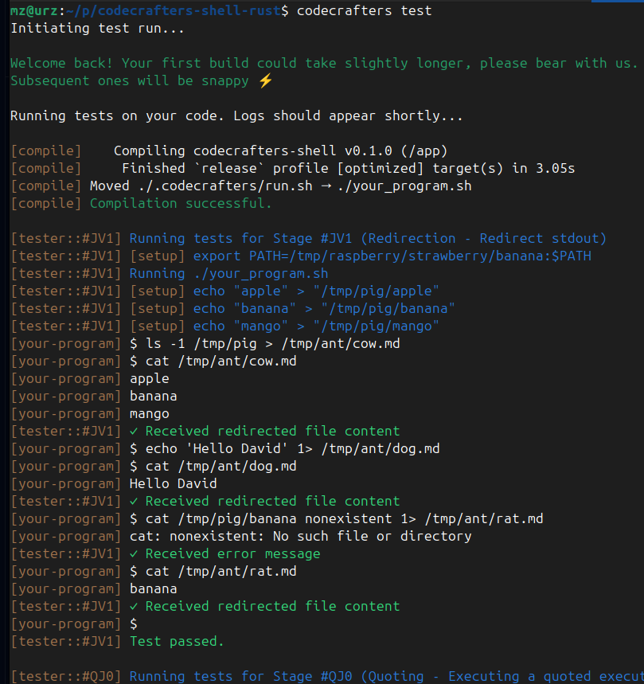

This is a Rust solutions to the
["Build Your Own Shell" Challenge](https://app.codecrafters.io/courses/shell/overview).

Note: it has 2 defects (compared to Bash or Dash):
* tokenizer is dumb: needs spaces around **>**. E.g. `grep -A100 '\[depend' Cargo.toml>/tmp/aa` fails.
* `history -r somefile` reads commands OK, but is not updating rustyline's Editor history
  (Up/Down arrows do not show those loaded commands).
  See d5fced6 `steps 30,31,32: HISTFILE read/write/append` commit message for a potential fix.

## `codecrafters` CLI

[Install `codecrafters` CLI](https://docs.codecrafters.io/cli/installation#how-do-i-install-the-cli)
and [use it to check your progress](https://docs.codecrafters.io/cli/usage):
```
# ...edit files, then
$ git add src/ Cargo.toml Cargo.lock
$ codecrafters test  # OR codecrafters test --previous
```


You may see [the full OK log codecrafters-test.log](codecrafters-test.log)

**NB** `install.sh` asks `sudo` permissions for installing into `/usr/local/bin/`.
Examine the script if unsure about it (and modify if you can):
```shell
curl -fsSLo cccli-install.sh https://codecrafters.io/install.sh
# cccli-install.sh: 91 lines - 2322 Bytes - 2026-01-22
```

**Note**: If you're viewing this repo on GitHub, head over to
[codecrafters.io](https://codecrafters.io) to try the challenge.

## See also
* [aaron-ang (2024-05-24..2025-06-04) + **all**](https://github.com/aaron-ang/shell-rust) I've fixed 1 bug in my [aang branch](https://github.com/mz0/codecrafters-shell-rust/tree/aang)
  * `command.rs`  `history.rs`  `main.rs`  `pipeline.rs`  `state.rs`  `token.rs`
  * `Cargo.toml` (edition = "2021") - `os_pipe 1.2`, `termion 4.0`, `strum = { version = "0.26", features = ["derive"] }`;
* [mariamikv (2025-06-10) + quotes, redirection](https://github.com/mariamikv/codecrafters-shell-rust)
  * `main.rs`, `commands.rs` - funny modularity; (?? potentially mem leaking) 'k _lifetime parameter_ use
  * `Cargo.toml` (edition = "2021") - unchanged
* [kov (2024-08-28..2025-05-23) + redirection, pipe (**both need ' '**, e.g. `echo aaaa|wc` fails), history](https://github.com/kov/codecrafters-shell-rust)
  * [main.rs](https://github.com/kov/codecrafters-shell-rust/blob/master/src/main.rs) - 696 lines, (??) 'r _lifetime parameter_ use
  * `Cargo.toml` (edition = "2021") + `dirs 5.0`, `os_pipe 1.2`, `rustyline 14.0`, `home =0.5.9`, `lazy_static 1.5.0`;
* [Max Taylor: Basic Shell in Rust](https://dev.to/maxtaylor/custom-replshell-in-rust-550j) / [code at github.com/max-taylor](https://github.com/max-taylor/simple-rust-shell/) / [video on YouTube](https://www.youtube.com/watch?v=A0DHPUrHc4w)
